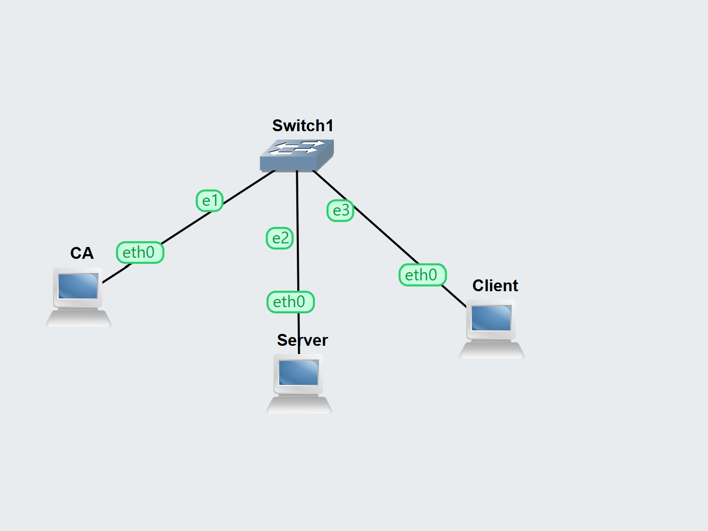
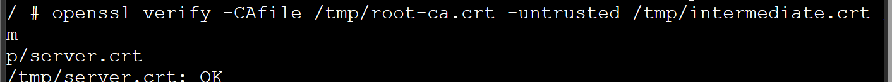
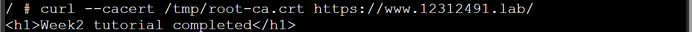
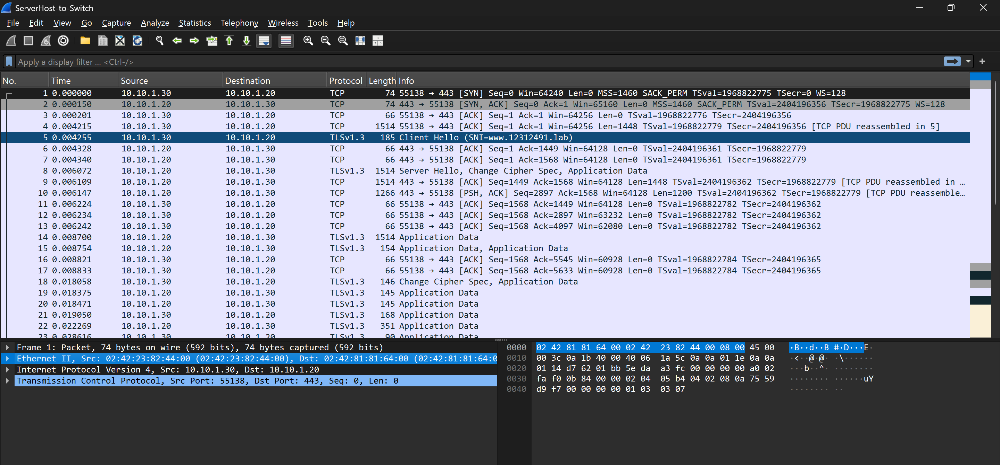

**OpenSSL Two-Tier CA: Lab Outputs**

*Student ID: 12312491*

# 1. Network Topology

The lab topology: three hosts (CA, Server, Client) all connected through Switch1, each on its own eth0 interface.



*OpenSSL-CA-12312491-network.png*

Addressing used:

- CA : 10.10.1.10/24
- Server : 10.10.1.20/24
- Client : 10.10.1.30/24

# 2. Certificate Chain Verification

Command run on the Client host, after copying the root CA, intermediate CA, and signed server certificate locally:

[COMMAND used]
```
openssl verify -CAfile /tmp/root-ca.crt -untrusted /tmp/intermediate.crt /tmp/server.crt
```

-CAfile supplies the trusted root; -untrusted supplies the intermediate certificate so OpenSSL can bridge the gap between the server certificate and the root; the final argument is the certificate being checked.



*OpenSSL-CA-12312491-verify.png*

**The output "/tmp/server.crt: OK" confirms that OpenSSL successfully walked the chain: server certificate to intermediate to root, and that every signature was validated correctly.**

# 3. HTTPS Connection Test

Command run on the Client host to request the page over HTTPS, trusting only the lab's own root CA:

[COMMAND used]
```
curl --cacert /tmp/root-ca.crt https://www.12312491.lab/
```

curl performs the full TLS handshake, validates the server's certificate chain against the supplied root, checks the hostname against the certificate's Subject Alternative Name, and only then retrieves the page.



*OpenSSL-CA-12312491-curl.png*

**The page content returned with no certificate warnings, confirming the client fully trusted the HTTPS connection end-to-end.**

# 4. Packet Capture Analysis

Capture taken on the link between Switch1 and the Server while the Client issued the curl request above.



*OpenSSL-CA-12312491-tls.pcap (opened in Wireshark)*

The sequence of events shown in the capture is as follows:

- In packets one to three, there is a standard TCP three-way handshake (SYN, SYN/ACK, and ACK) between Client (IP address 10.10.1.30) and Server (IP address 10.10.1.20) on port 443 before any TLS negotiation starts.
- In packet number five, the Client sends Client Hello (SNI=www.12312491.lab): the first TLS message in clear text. The Server Name Indication (SNI) field can be seen, where exactly it can be seen which hostname the Client has asked from the Server, which leads to correct selection of the certificate for the server.
- In packet number eight, the Server responds and sends the Server Hello, 'Change Cipher Spec' and Application data as part of the message exchanged.
- In packet number eighteen: 'Change Cipher Spec' and application data are the second packets sent for encryption. The Client can confirm that it uses encrypted communications.
- Later application data packets are used to show the actual HTTP request and response data (also known as data sent through curl), which is totally encrypted during transmission, so only the size is visible in Wireshark.

# 5. Discussion Answers

What does an intermediate CA do? It allows the root CA key to remain offline and secure, while the intermediate CA does all the signing daily. In case the intermediate CA gets compromised, it is only that certificate that has to be revoked, leaving the root that is already trusted intact.

What does openssl verify do? It verifies the chain from the leaf certificate all the way up to the supplied intermediates and the trusted root, making sure all signatures and validity dates are correct and that every step obeys the given basic constraints. When there is no intermediate in the chain, the verification process fails because of a gap between the leaf and the trusted root.

Why can't HTTP data be read in the capture? Initially, there is a TLS handshake, and the two parties establish the session key using their own certificates. As soon as the handshake is finished, the HTTP body data cannot be read because it is encrypted using the session key.

# 6. Questions and Answers
1. Purpose of the intermediate certificate authority
<p> The intermediate certificate authority protects the root certificate authority's keys by keeping it offline while performing the routine signing operations. In case the intermediate is compromised, you will have to simply revoke it, but your root certificate authority would remain safe and secure. </p>

2. What does openssl verify do
<p>It verifies by traversing from the certificate to be validated up to the trusted root certificate au thority, making sure about the signature, expiry dates and the permissions. In case the intermediate certificate is not there, the connection between the certificate and the trusted root will not exist, and the validation will not take place. </p>

3. Why captures do not show HTTP content
<p> While the handshake is performed between the two parties, they should see it to set up the encryption process. Once the encryption is established, all the information is encrypted. Wireshark would see some data going but would not see its content. </p>

4. Self-signed and CA-signed
<p> Self-signed means the user is making the claim on his own. No trust from outside is involved; browsers give warnings accordingly. Good for non-production usage.
CA-signed means a trusted authority vouches for you. Clients trust it automatically, no warnings. Needed for anything real users connect to. </p>


