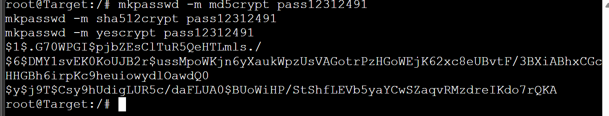
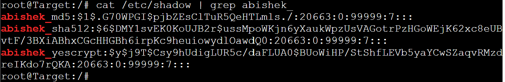
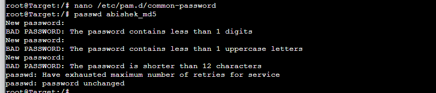
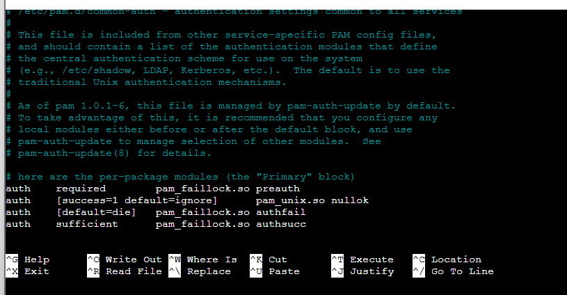
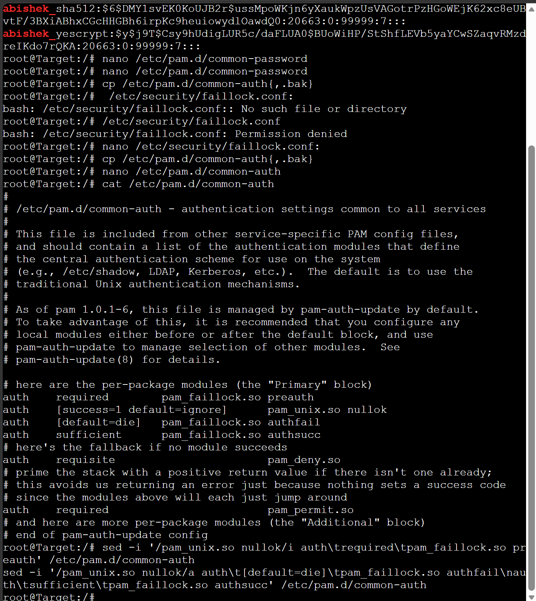
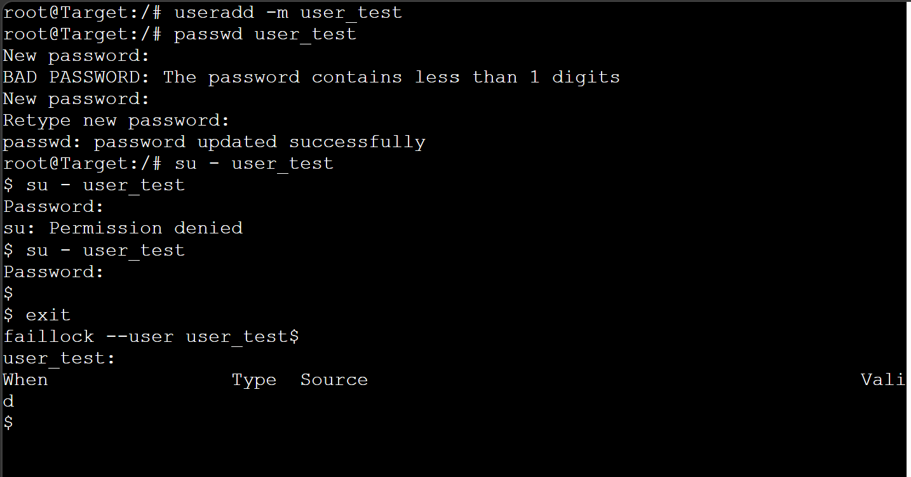
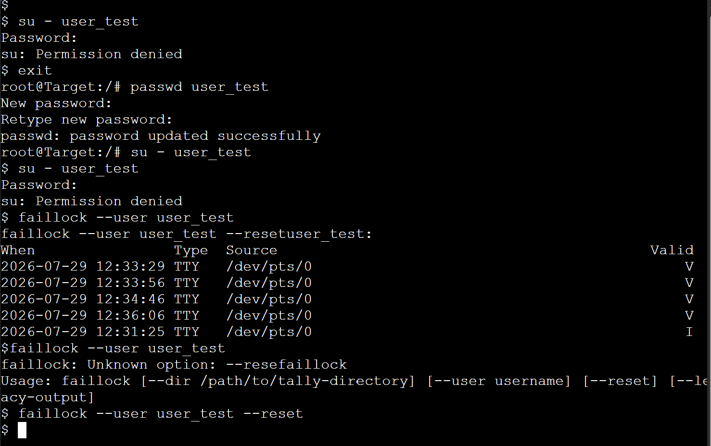
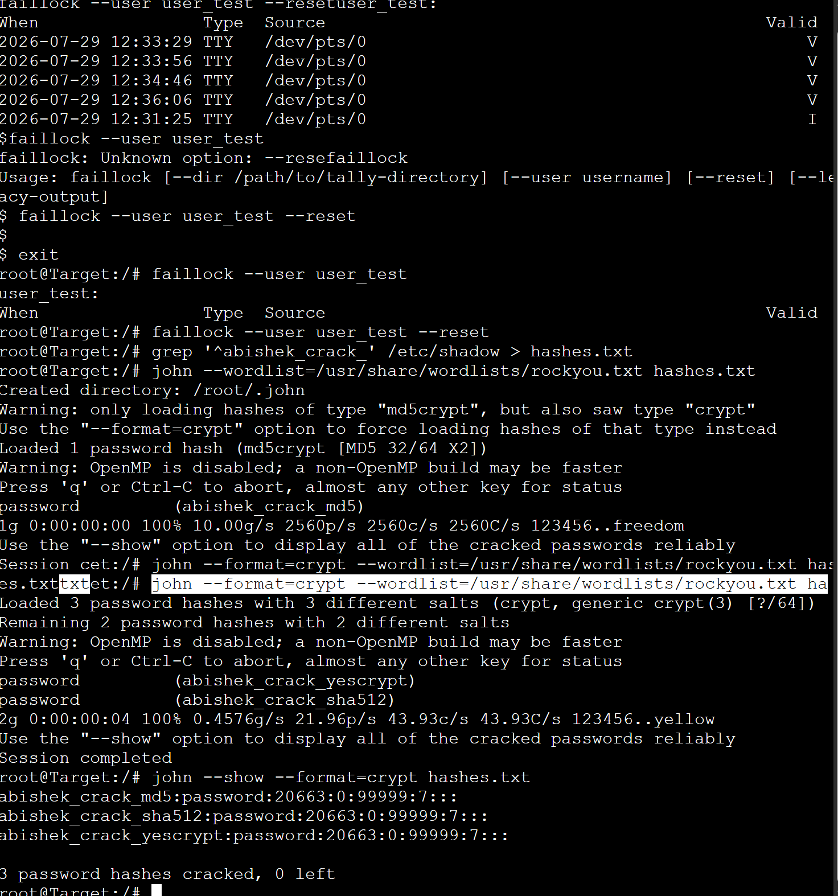

# Password Hashing Lab Report

**Project:** Password-Hashing-12312491 | **Target:** Ubuntu Host

## Aim

Compare password hashing algorithms by creating users with different hash types, examining /etc/shadow, and configuring PAM password policies; then observe cracking speed differences using a password cracker (John the Ripper).

## 1. Setup

- Create a project named Password-Hashing-12312491.
- Add one Ubuntu Host node. Label it Target. Start the node.

## 2. Examine Hash Algorithms

On Target, create three users with the SAME password (containing the student ID, pass12312491) but three different hashing algorithms: MD5 (md5crypt), SHA-512, and yescrypt.

### Generate hashes

```bash
mkpasswd -m md5crypt pass12312491
mkpasswd -m sha512crypt pass12312491
mkpasswd -m yescrypt pass12312491
```



### Create users (hash wrapped in single quotes)

```bash
useradd -p '$1$.G70WPGI$pjbZEsClTuR5QeHTLmls./' abishek_md5
useradd -p '$6$DMY1svEK0KoUJB2r$ussMpoWKjn6yXaukWpzUsVAGotrPzHGoWEjK62xc8eUBvtF/3BXiABhxCGcHHGBh6irpKc9heuiowydlOawdQ0' abishek_sha512
useradd -p '$y$j9T$Csy9hUdigLUR5c/daFLUA0$BUoWiHP/StShfLEVb5yaYCwSZaqvRMzdreIKdo7rQKA' abishek_yescrypt
```

⚠️ **Do NOT run a successful passwd on abishek_md5, abishek_sha512 or abishek_yescrypt afterwards:** it rewrites the hash with the system default (yescrypt) and destroys the recorded hash.

View /etc/shadow and locate the three new entries. Identify the algorithm prefix, salt, and hash for each, and copy each full hash string to a text file on the host machine.

```bash
cat /etc/shadow | grep abishek_
```



**Common prefixes:** $1$ = MD5-crypt, $5$ = SHA-256, $6$ = SHA-512, $y$ = yescrypt. The salt follows the prefix, before the next $.

## 3. Configure PAM Policies

### 3.1 Password quality (pam_pwquality)

Edit /etc/pam.d/common-password and enforce: minimum length 12, at least one uppercase letter, at least one digit.

```bash
nano /etc/pam.d/common-password
```

```
password requisite pam_pwquality.so retry=3 minlen=12 ucredit=-1 dcredit=-1 enforce_for_root dictcheck=0
```

`enforce_for_root` is required because pam_pwquality only warns (but still allows) weak root-set passwords by default. `dictcheck=0` is required because this Ubuntu image ships no cracklib word-list, so a compliant password would otherwise fail on a missing-dictionary error rather than being accepted.



### 3.2 Account lockout (pam_faillock)

Back up the auth file before editing, in case of a mistyped line.

```bash
cp /etc/pam.d/common-auth{,.bak}
```

Set the lockout policy in /etc/security/faillock.conf:

```
deny = 5
unlock_time = 300
```

Wire pam_faillock into /etc/pam.d/common-auth: preauth BEFORE pam_unix.so, authfail/authsucc AFTER it (order matters):

```
auth required pam_faillock.so preauth
auth [success=1 default=ignore] pam_unix.so nullok  # existing line
auth [default=die] pam_faillock.so authfail
auth sufficient pam_faillock.so authsucc
```





### 3.3 Testing both policies (throwaway user)

Create a throwaway account: `useradd -m user_test`. Never test policies against the three algorithm users.

**Password quality:** try a weak password first (rejected), then a compliant one such as Str0ngPassphrase12 (accepted). Keep this password: it is needed below.

```bash
passwd user_test
# new password: abc               -> rejected
# new password: Str0ngPassphrase12 -> accepted
```

**Account lockout:** root is exempt from authentication, so failures must come from a non-root shell. Become user_test (free, root is exempt), then re-authenticate as user_test from that shell with a WRONG password five times.

```bash
root@Target:~# su - user_test        # become user_test : root exempt, not counted
user_test@Target:~$ su - user_test   # re-authenticate : type a WRONG password
su: Authentication failure
... (repeat until 5 failures: account then locks)
user_test@Target:~$ su - user_test   # even the CORRECT password is now refused
su: Authentication failure
```



**Alternative over SSH:** /bin/start-ssh.sh, then ssh user_test@localhost with 5 wrong passwords.

Check and clear the lockout from the root console:

```bash
faillock --user user_test
faillock --user user_test --reset
```



## 4. Verify: Cracking the Hashes

A dictionary attack will succeed only in locating a password in the wordlist. The student-ID password is intentionally not a word found in the dictionary, meaning it will NOT be cracked as it is supposed to. In order to see a successful crack and calculate speeds, a second set of users was introduced, with a confirmed password in rockyou.txt.

Confirm a wordlist password (an early line in rockyou.txt, guaranteed hit):

```bash
grep -x 'password' /usr/share/wordlists/rockyou.txt
```

Create three more users with that password, one per algorithm:

```bash
useradd -p "$(mkpasswd -m md5crypt password)" abishek_crack_md5
useradd -p "$(mkpasswd -m sha512crypt password)" abishek_crack_sha512
useradd -p "$(mkpasswd -m yescrypt password)" abishek_crack_yescrypt
```

**Tool used:** John the Ripper (inside the Ubuntu Host, rockyou.txt pre-installed).

```bash
grep '^abishek_crack_' /etc/shadow > hashes.txt
john --wordlist=/usr/share/wordlists/rockyou.txt hashes.txt         # md5crypt auto-detected
john --format=crypt --wordlist=/usr/share/wordlists/rockyou.txt hashes.txt   # for $6$ and $y$
john --show --format=crypt hashes.txt
```

### Results

john --show confirmed all three passwords recovered as "password":

```
abishek_crack_md5:password:20663:0:99999:7:::
abishek_crack_sha512:password:20663:0:99999:7:::
abishek_crack_yescrypt:password:20663:0:99999:7:::
3 password hashes cracked, 0 left
```



**Observed pattern:** MD5 was broken essentially immediately at ~2560 candidates per second. SHA-512 and yescrypt were attacked in the second John session together, recording a cumulative rate of ~21.96–43.93 candidates per second, or about two orders of magnitude slower than MD5. This proves the expected ranking of MD5 as the fastest one to break, followed by SHA-512 and yescrypt ranked as the slowest/most secure.

## 5. Outputs Checklist

- Exported project file: Password-Hashing-12312491.gns3project
- Screenshot of the network: (add separately, not embedded in the source document)
- Screenshot of the /etc/shadow entries: `images/02-shadow-entries.png`
- Screenshot of the cracking tool's output: `images/08-john-cracking-results.png`

## 6. Questions

### Q1. What do the prefixes $1$, $6$, and $y$ in /etc/shadow indicate, and why does the algorithm choice matter for password security?

Each /etc/shadow password field follows the format $id$salt$hash. The id identifies which hashing algorithm produced that entry:

- $1$ : MD5-crypt
- $5$ : SHA-256-crypt
- $6$ : SHA-512-crypt
- $y$ : yescrypt

The selection of the algorithm is significant as this affects the cost of an attacker's brute-force hash offline after obtaining /etc/shadow. $1$ (MD5) is an old algorithm developed for speed; current GPUs are capable of generating billions of MD5 hashes in just a second, making it very easy to crack the hash offline. $6$ (SHA-512) is a better option because it is stronger and offers options to increase the number of rounds, but it is still a fast hashing method. $y$ (yescrypt) is the current default selected by most distributions. This is a memory-heavy KDF that is deliberately slow and consumes a large amount of RAM on every attempt, resulting in a situation where the attacker's advantage is significantly reduced. The prefix therefore tells you the real-world cost per guess an attacker faces: which, as demonstrated in Section 4, can differ by two or more orders of magnitude between $1$ and $y$.

### Q2. Why is a slow hashing algorithm (like yescrypt or bcrypt) preferred for password storage, even though it uses more CPU time on the server during legitimate logins?

There is a major inherent asymmetry to password hashing. A legitimate login is not a frequent occurrence (only once per session), so the additional time taken (about a few milliseconds) is barely noticeable to the user. In contrast, an attacker has plenty of time and a great many guesses to make while conducting the offline attack, and a slow memory-hard function causes an attacker to spend the same small amount of time making each guess. Memory-hardness furthermore limits GPUs and ASICs since the relevant architecture has no fast memory relative to the processing capacity. This is exactly the effect measured in Section 4: yescrypt's ~44 candidates/second versus MD5's ~2560 candidates/second is a deliberate, engineered slowdown.

### Q3. What is a salt in the context of password hashing, and what attack does it prevent? Identify the salt in one of the /etc/shadow entries.

A salt represents a random value created for each passcode and saved with the hash value as well (it is the second field in $id$salt$hash). The mixing process includes the salt when calculating the hash to ensure that the same passcode will generate different hashes for different users. With a salt, the attack that uses a pre-calculated dictionary or rainbow tables will not work since, otherwise, the hacker would only have to hash one wordlist to then compare it to all the entries of the stolen shadow file.

**Example from this lab's /etc/shadow entries (user abishek_sha512):**

```
abishek_sha512:$6$DMY1svEK0KoUJB2r$ussMpoWKjn6yXaukWpzUsVAGotrPzHGoWEjK62xc8eUBvtF/3BXiABhxCGcHHGBh6irpKc9heuiowydlOawdQ0:20663:0:99999:7:::
```

Splitting on $: id = 6 (SHA-512), salt = DMY1svEK0KoUJB2r, hash = the remaining string.

### Q4. The pam_faillock module locks accounts after repeated failures. What is a potential downside of this approach, and how might an attacker exploit it?

Lockout measures can be misused for denial-of-service attacks through username enumeration. The attacker may know or guess some valid usernames, then they may repeatedly try the wrong password on the account in question to trigger lockout and render the user unreachable. This can range from inconvenience situations to considerably severe scenarios (e.g. when an administrator or a group of staff members are locked out at a critical moment).

**Attack scenario:** First, enumerate or guess usernames (through hacking databases, email addresses, or any leaked posts regarding usernames) and send a sufficient number of incorrect passwords to exceed the set number of failed login attempts (e.g. as per Section 3.2). Some effective workarounds include limiting the rate of logins originating from the same IP address, making the lockout less severe, CAPTCHAs, and alerting on lockouts involving a certain number of accounts.

## Summary Tables

| User | Algorithm | Salt | Prefix |
|------|-----------|------|--------|
| abishek_md5 | MD5-crypt | .G70WPGI | $1$ |
| abishek_sha512 | SHA-512 | DMY1svEK0KoUJB2r | $6$ |
| abishek_yescrypt | yescrypt | Csy9hUdigLUR5c/daFLUA0 | $y$ |

| Algorithm | Hash prefix | Result | Notes |
|-----------|-------------|--------|-------|
| MD5-crypt | $1$ | Cracked instantly | ~2560 candidates/sec |
| SHA-512 | $6$ | Cracked in ~4s (combined run) | ~21.96 candidates/sec |
| yescrypt | $y$ | Cracked in ~4s (combined run) | ~43.93 candidates/sec (combined session) |
