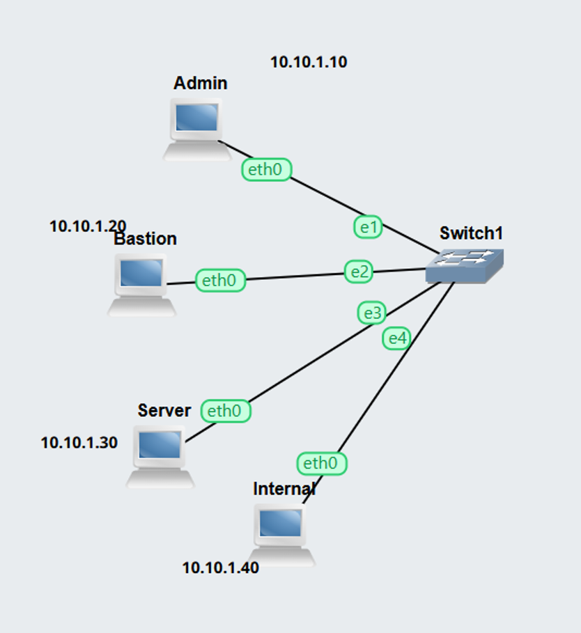
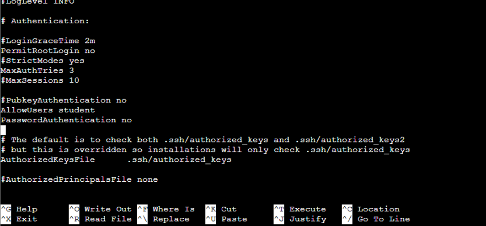
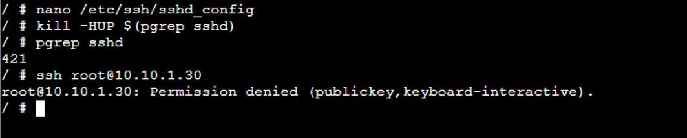
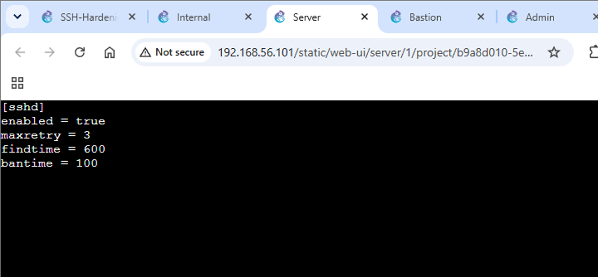
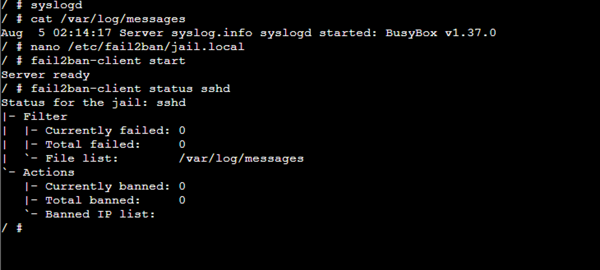
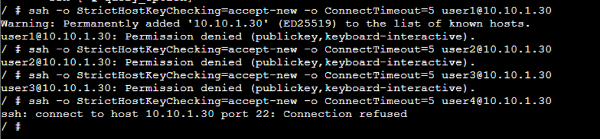
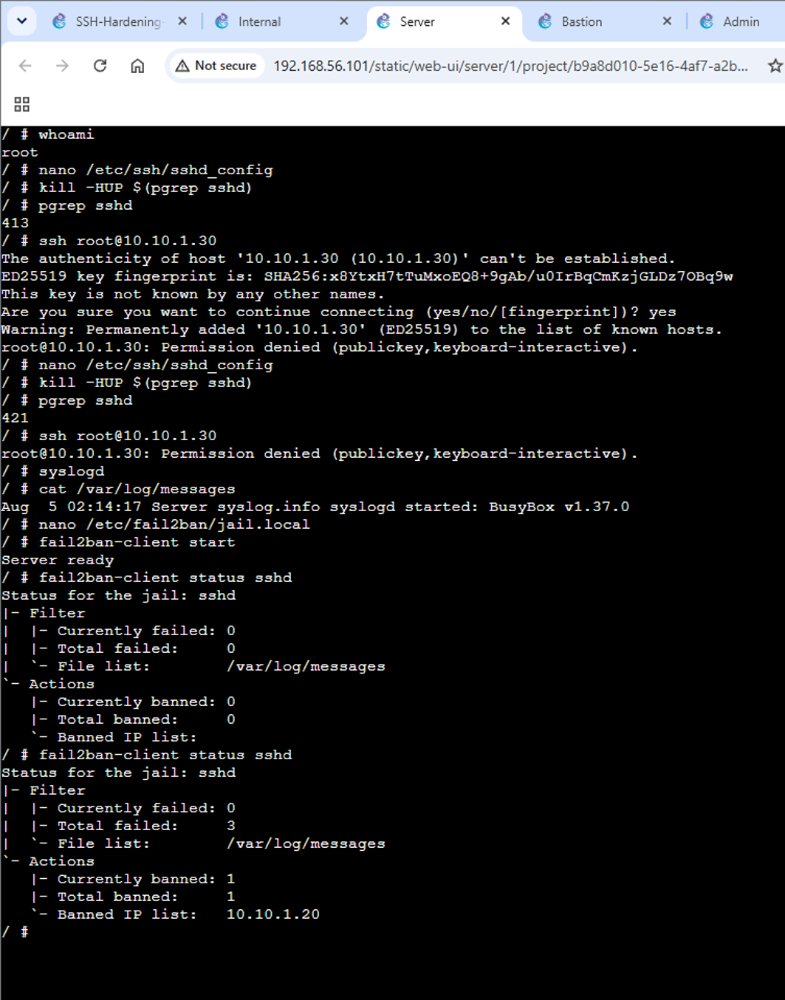

# SSH Hardening-Keys, fail2ban and Tunnelling

**Project:** SSH-Hardening-12312491 | **Student:** Abishek Sapkota | **Student ID:** 12312491

## 1. Network Topology

Four hosts on one switched LAN: Admin, Bastion, Server and Internal, all connected to Switch1, addressed as follows:



*Figure 1: Lab topology and addressing*

- Admin: 10.10.1.10/24 (holds the Ed25519 key pair)
- Bastion: 10.10.1.20/24 (jump host)
- Server: 10.10.1.30/24 (hardened SSH server)
- Internal: 10.10.1.40/24 (internal web service)

## 2. Key-Based Authentication Setup

An Ed25519 key pair was completed on Admin (ssh-keygen -t ed25519). The public key was used to establish an ordinary login for root on the server (to confirm functionality before the application of explicit hardening), as well as for the pre-configured student user, thus making sure the intended user for the server after the implementation of Task 4 was already in place beforehand.

## 3. SSH Server Hardening

The four hardening directives were set in /etc/ssh/sshd_config on the server:



*Figure 2: Hardened sshd_config: PermitRootLogin no, MaxAuthTries 3, AllowUsers student, PasswordAuthentication no*

The configuration was reloaded and verified:

```bash
kill -HUP $(pgrep sshd)
pgrep sshd
ssh root@10.10.1.30
```



*Figure 3: Root login refused after reload: Permission denied (publickey, keyboard-interactive)*

This confirms that PermitRootLogin no is currently enforced. It was confirmed for students using key authentication (without requiring a password), as well as that of the block of the forced password authentication (ssh -o PubkeyAuthentication=no student@10.10.1.30), showing that all three rules: key-only authentication, the unique account in use, and prohibition of root access, are being applied simultaneously.

## 4. Blocking Brute-Force Attempts with fail2ban

### 4.1 Jail configuration

/etc/fail2ban/jail.local was configured to ban after 3 failed attempts within a 100-second window:



*Figure 4: jail.local: enabled = true, maxretry = 3, findtime = 600, bantime = 100*

### 4.2 Starting the logger and fail2ban

The system logger was started so sshd's failed-login records would be written to /var/log/messages, then fail2ban was started, and the jail confirmed as idle (0 currently banned) before the attack:

```bash
syslogd
fail2ban-client start
fail2ban-client status sshd
```



*Figure 5: syslogd and fail2ban started; jail sshd active with 0 failures/bans so far*

### 4.3 Triggering a ban from Bastion

Bastion made several login attempts as users who do not exist. The first three attempts were refused: permission was denied. The fourth failed: there was a connection refused, resulting in an immediate connection ban.



*Figure 6: Three refused attempts, then Connection refused once banned*

### 4.4 Confirming the ban

Checking the jail again on the server shows Bastion's address banned:



*Figure 7: fail2ban-client status sshd: Currently banned: 1, Banned IP list: 10.10.1.20*

## 5. Tunnelling to the Internal Service

The setting of AllowTcpForwarding was enabled in Bastion's sshd_config file and changed. After this, the Admin key was also set in the Bastion server. The next step was connecting from Admin to the Internal web application service, where the curl command was used to verify the connection through the forwarded local port:

```bash
ssh -f -N -L 9090:10.10.1.40:8080 root@10.10.1.20
curl http://localhost:9090/
```

The packet captures were made on both the Admin switch and Internal switch links simultaneously with the request being made. The Admin switch packet capture included the encrypted traffic of the SSH service on port 22, which means that Admin did not connect directly with the Internal server. However, the capture of the Internal switch shows the HTTP GET command and the reply from the web service, which was received from the Bastion host (address 10.10.1.20) rather than from the Admin.

Evidence: the two packet captures (`SSH-Hardening-12312491-admin.pcap`, `SSH-Hardening-12312491-internal.pcap`) and the GNS3 project file (`SSH-Hardening-12312491.gns3project`) are included alongside this document.

## 6. Discussion

**Q1. Why is Ed25519 recommended over RSA for new SSH key pairs? What are the practical differences?**

Ed25519 is preferred in place of RSA for the generation of new SSH key pairs due to the reliability of security. During the task, Ed25519 was used to create the SSH key pair through ssh-keygen -t ed25519. Ed25519 keys are shorter and have a faster generation and usage process than RSA keys, which makes Ed25519 keys more reliable for the new implementations.

In practical terms, Ed25519 provides favourable conditions for the creators of new SSH keys by providing enough security with the shortest size in comparison with RSA. As a result, the Ed25519 key was successfully copied to the Server for further usage as a password-free login solution.

**Q2. How does fail2ban defend an SSH server against repeated failed logins, and what is one limitation of relying on it alone?**

fail2ban is a software program that is used to prevent unauthorised access to a server, specifically focusing on login attempts through the SSH protocol. The jail has been set up with a maximum number of allowed login attempts set to three, and with both the time to count failed attempts and the length of time to ban an IP address set to 100 seconds. As a result, if any IP fails to log in to the server three times within 600 seconds, it will be banned for the next 100 seconds.

For example, some unsuccessful login attempts from the Bastion system have led to its IP address, which is 10.10.1.20, being put on the list of banned addresses. Afterwards, any connections to this address will be rejected with the information that no connection is possible. However, the drawback of the application is that it does not block the user before a certain number of tries is exceeded, so it can't be used as the only method of strengthening security.

**Q3. You configured both key-only authentication (Task 4) and fail2ban (Task 5). Explain how these two controls complement each other: what does each one stop that the other does not?**

Both key-only authentication and fail2ban provide security for the SSH server, but in different ways. Key-only authentication does not allow users to log in using the password, because the PasswordAuthentication option is turned off. Also, it does not permit root login and limits the users who can use SSH to only student accounts using the AllowUsers command. Because of those features, any attacker cannot simply break into the server using the username and password of the user.

On the other hand, Fail2ban provides further protection by detecting repeated failed login attempts and blocking the IP of the attacker. The fail2ban activity shows that in the case where there were three failed attempts in the time allowed, the IP of the Bastion was blocked. Thus, we can conclude that key-only authentication does not allow login based on the password, whereas fail2ban blocks the IP address making repeated connection attempts.

**Q4. Explain the difference between local port forwarding (-L) and remote port forwarding (-R). In which scenario would you use each?**

Using local port forwarding (-L) opens up a listening port on the local system and conveys network communications, simulating the presence of the SSH server on a certain host and port. For example, by executing the command ssh -f -N -L 9090:10.10.1.40:8080 root@10.10.1.20, the port 9090 on Admin will be created and used for data communication through Bastion to the port 8080 of the Internal server. This results in the ability to access the service through the command curl http://localhost:9090/. At the same time, remote port forwarding (-R) performs the opposite activities. More specifically, it creates a listening port on the remote SSH server and forwards connections towards the local side. When I need to access the service available from the SSH server and not accessible from my local computer, I will use the -L option. Conversely, using -R, I will ensure my service on the private network is made available through the SSH server.

**Q5. Compare your two .pcap files. What is readable on the Admin-switch link, and what is readable on the Internal-switch link? Explain why the same web request looks different at the two points, what each capture proves about the tunnel, and what the second one tells you about where the protection stops.**

The report regarding the Admin-switch reveals that the web request is inaccessible in straight HTTP format. What's captured is secured SSH traffic running on port number 22 from the Admin to the Bastion server. The Admin is not directly communicating with the Internal server. This information indicates that the web request from localhost:9090 is encapsulated in the SSH tunnel set between the Admin and the Bastion.

The Internal-switch report is the one portraying the web request in a plain, readable format. The report indicates that the GET request is plain text, and the reply is from the Internal server. The request seems to have originated from the Bastion IP, which is 10.10.1.20, due to the Bastion making the connecting hop to the Internal server. Although the same request takes a different form while proceeding through the SSH tunnel from the Admin to the Bastion, the request is plain after reaching the Bastion since it is HTTP traffic meant for the Internal server. Thus, the capturing process indicates two important statements: one is the fact that SSH protects the traffic between the Admin and the Bastion, and the second statement shows that the security coverage ends with the Bastion.
